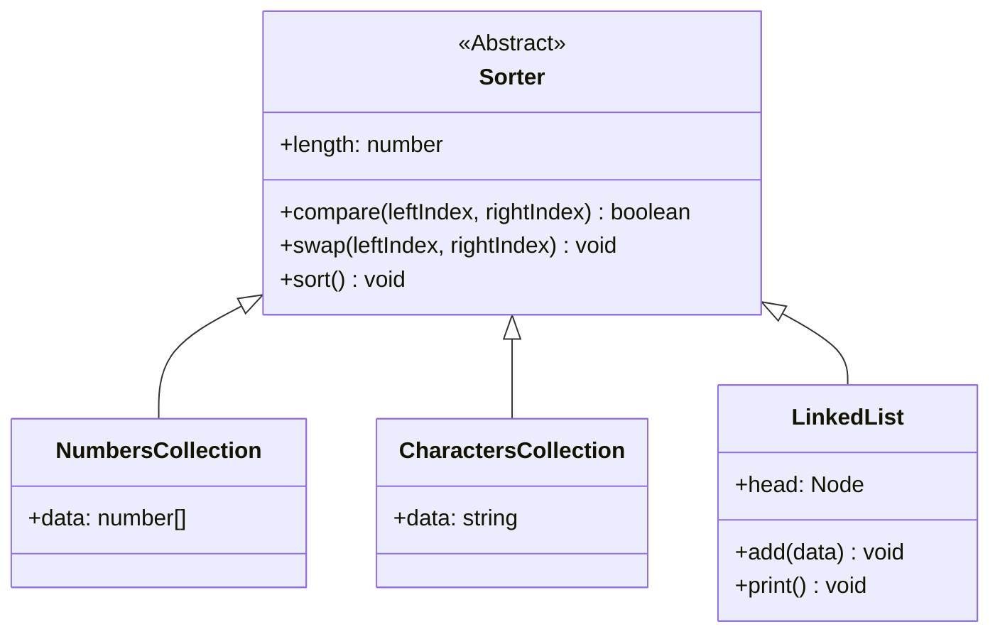

# TypeScript Sorting Engine 🚀

An elegant, highly decoupled object-oriented sorting application built with TypeScript. The project demonstrates the evolution of software architecture from tight structural coupling to an abstract class hierarchy using the **Template Method Pattern** [source: 11].

---

## 🏗️ Architecture Design: The Template Method Pattern

Instead of wrapping external collections inside a sorter object middleman, this engine uses class inheritance [source: 11, 13]. The master `Sorter` is a strict abstract parent blueprint that dictates the overarching Bubble Sort algorithm execution flow (`sort()`) [source: 11]. It relies entirely on its child implementations to supply the custom, context-driven data mechanics [source: 11].



### The Abstract Contract
Any data structure can instantly acquire direct sorting capabilities simply by extending `Sorter` and satisfying its three mandatory abstract target structures [source: 11]:
1. `get length(): number` — Exposes the overall size of the dataset [source: 11].
2. `compare(leftIndex: number, rightIndex: number): boolean` — Custom validation logic evaluating values at two separate indices [source: 11].
3. `swap(leftIndex: number, rightIndex: number): void` — The physical data mutation steps required to shift values in memory [source: 11].

---

## 🗂️ Core Project Modules

### 🔢 1. NumbersCollection (`src/NumbersCollection.ts`)
*   **Role:** Handles evaluation and index-based swapping for standard numeric primitives [source: 8].
*   **Mechanics:** Uses a standard temporary tracking variable to swap numbers directly within a native array [source: 8].

### 🔤 2. CharactersCollection (`src/CharactersCollection.ts`)
*   **Role:** Manages a text string for case-insensitive alphabetical sorting [source: 10].
*   **Mechanics:** Uses `.toLowerCase()` to bypass raw ASCII table value constraints [source: 10]. Resolves native string immutability restrictions by converting the dataset to an array via `.split("")` during the swap step, then re-compiling it with `.join("")` [source: 10].

### 🔗 3. LinkedList (`src/LinkedList.ts`)
*   **Role:** Manages linear node-based reference chains [source: 12].
*   **Mechanics:** Features a structural tracking `Node` class [source: 12]. Elements must be traversed sequentially via lookup links ($O(N)$ tax) [source: 12]. It streamlines structural updates by swapping inner numeric `.data` properties directly, avoiding complex pointer chain re-linking [source: 12].

---

## 🚦 Execution Sandbox (`src/index.ts`)

Because the sorting engine is built into the classes themselves, runtime execution is beautifully simple [source: 13]. You call `.sort()` directly on the collection dataset instances [source: 13]:

```typescript
import { NumbersCollection } from "./NumbersCollection";
import { CharactersCollection } from "./CharactersCollection";
import { LinkedList } from "./LinkedList";

// 1. Array of Numbers
const numbers = new NumbersCollection([10000, 10, 3, -5, 0]);
numbers.sort();
console.log(numbers.data); // Output: [-5, 0, 3, 10, 10000]

// 2. Text Strings (Case-Insensitive)
const characters = new CharactersCollection("Xaayb");
characters.sort();
console.log(characters.data); // Output: "aaybX"

// 3. Linear Node Chains
const linkedList = new LinkedList();
linkedList.add(500);
linkedList.add(-10);
linkedList.add(4);
linkedList.sort();
linkedList.print(); // Output: -10, 4, 500
```

---

## ⚙️ Getting Started

Want to run this project on your own machine? Here is everything you need to get set up.

### What you'll need first
*   [Node.js](https://nodejs.org) (npm comes bundled with it) [source: 9]
*   [Git](https://git-scm.com) [source: 9]

### Setting things up

1. **Grab the code** [source: 9]
   ```bash
   git clone https://github.com
   cd Typescript-Exercises/sort
   ```

2. **Install dependencies** [source: 9]
   ```bash
   npm install
   ```
   *Note: This command reads `package.json` to configure tools like `nodemon`, `concurrently`, and `typescript` fresh on your local machine [source: 9].*

3. **Start the workspace** [source: 9]
   ```bash
   npm start
   ```
   *This kicks off two parallel automation routines via `concurrently`:* [source: 9]
   *   `tsc -w` — The TypeScript compiler watches your source directory and builds changes incrementally [source: 9].
   *   `nodemon` — Restarts your app automatically whenever newly compiled JavaScript lands inside the build folder [source: 9].

---

## 📋 Compilation Notes
*   **Environment Segregation:** All core TypeScript source code lives inside `src/`, while the automated compiler targets output files directly to the executable `build/` directory [source: 9].
*   **Version Control:** The `node_modules/` and `build/` directories are intentionally excluded from git version tracking via `.gitignore` to maintain a lean, performance-focused repository footprint [source: 9].
